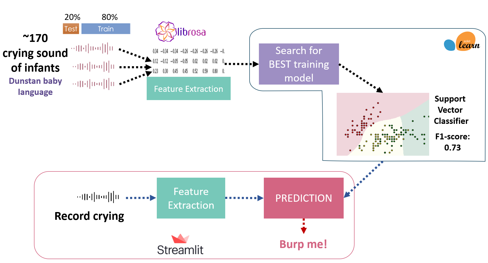

# Infant-cry-classification with SVC 

### This project was done based on Dunstan Baby Languague theory to classify most common 5 reasons for baby to cry, which are:
- Hungry
- Sleepy/tired
- Need to burp
- Lower wind pain/ gas
- Discomfort: nappy change/ too hot/ too cold

## Data
Collect and being mannually labeled. Only very limitted data is available.  
Record of 1 sec audio of baby cry in quite room.

## Process

## Language and libraries used   
- Python
- Librosa
- Scikit-learn
- Streamlit

## Reference
Dunstan Baby Language: https://www.youtube.com/watch?v=IYz6tE3XmHM
